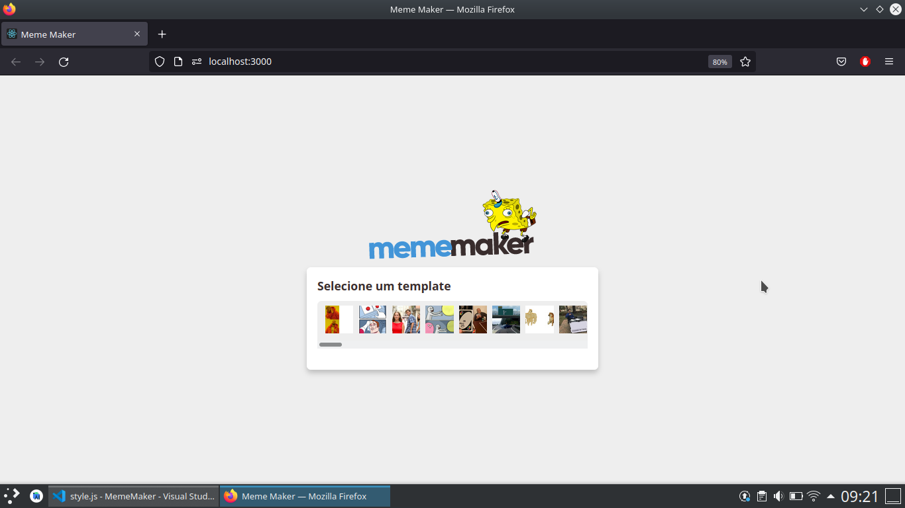

# Meme Maker

## 💻 Projeto

Aplicação foi desenvolvida para cirar memes, com a imgflip API, o os memes são o mais atuais, além disso, o usuário pode personalizar do seu jetio.

## 🌐 Preview

 
    
Tela de Home 

    

 
    
Escolhido o meme 

    

 
    
Meme criado 

    

## 🚀 Tecnologias

Esse projeto foi desenvolvido com as seguintes tecnologias:

- ReactJs
- JavaScript
